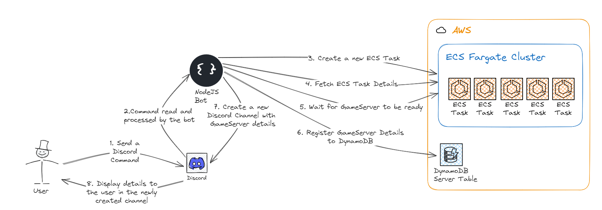

# Project Documentation
## Overview
This documentation provides an overview of the "mineralcontest-discord-server-provider" project and its components. It includes information on how to set up and use the project, as well as details on the technologies and tools used.

## Table of Contents
- [Overview](#overview)
- [Prerequisites](#prerequisites)
- [How to use](#how-to-use)
- [Technologies](#technologies)
- [Contributing](#contributing)
- [License](#license)

## Overview
This documentation provides an overview of the "mineralcontest-discord-server-provider" project and its components. It includes information on how to set up and use the project, as well as details on the technologies and tools used.

If you want to read more about my choices, you can read the Medium article I wrote about this project: https://medium.com/@monvoisinkevin/1fb9a943bd38

## How it works

## Prerequisites
Before getting started with the project, make sure you have the following prerequisites installed:
- Discord client
- AWS CLI
- NodeJS (v20)
- Python 3.10+

## How to get Discord Channels and Roles ID ?
1. Head into your Discord Settings
2. Go to Advanced
3. Enable Developer Mode
4. Right click on your Discord Server, Discord User, Discord Channel Category, Discord Channel and click on "Copy Identifier [...]"
5. Paste the value to the configuration tool when asked!

## How to use
To deploy the project, follow these steps:

- Set your AWS credentials (AWS_ACCESS_KEY_ID, AWS_SECRET_ACCESS_KEY)
- Clone this repository `git clone https://github.com/Synchroneyes/gameserver-discord-aws-mc`
- Head into the cloned repository: `cd gameserver-discord-aws-mc`
- Initialize the project: `python Make.py init`
- Configure the necessary settings: `python Make.py configure`
- Deploy the required infrastructure project: `python Make.py install`
- Invite your Discord Application into your Discord Server, when you run the `python Make.py install` command, the invitation link is displayed into your terminal. If not, you can use the `python Make.py discord_invite_link` command.
- Run the Discord Bot: `python Make.py run_discord_bot`

## Technologies
This project utilizes the following technologies and tools:
- Discord: A communication platform used as a client to request game servers.
- AWS: A cloud computing platform used for creating game servers.
- ECS: A container orchestration service used for managing game server instances.
- JavaScript: A programming language used for developing the Discord bot that interacts with AWS.

